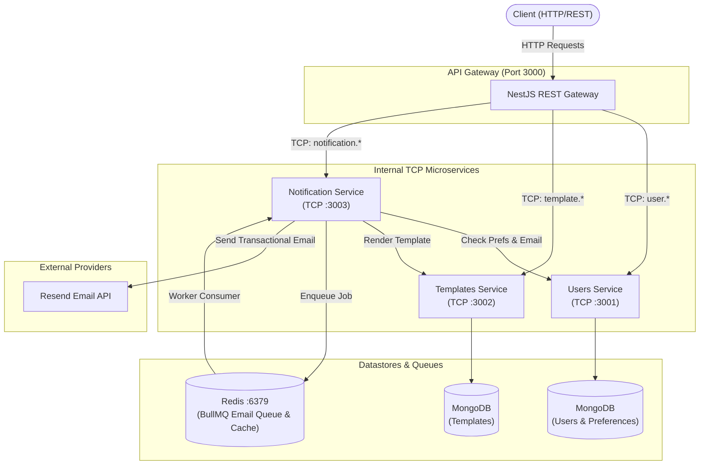

# Distributed Notification Service

A scalable, distributed notification and template rendering platform built as a TypeScript monorepo using **NestJS**, **Turborepo**, and **Bun**. The system manages users, custom notification preferences, dynamic email templates (compiled via Handlebars), and reliable background email dispatching powered by **BullMQ**, **Redis**, and **Resend**.

---

## Architecture Overview

The system is decoupled into an HTTP API Gateway and three dedicated microservices communicating internally via TCP RPC:



### Flow for Email Notification Dispatch:

1. Client issues `POST /notifications/send-email` to the **API Gateway**.
2. Gateway routes the request to **Notification Service** over TCP (`cmd: 'notification.sendEmail'`).
3. **Notification Service** checks recipient user record & notification preferences from **Users Service** (cached with in-memory TTL).
4. If `emailNotifications` is disabled, the request completes gracefully without sending.
5. If a `templateId` is specified, **Notification Service** invokes **Templates Service** (`cmd: 'template.render'`) to compile the Handlebars template with variables.
6. The compiled email is enqueued in the **BullMQ** `email` queue in Redis (with 4 retries and exponential backoff).
7. The background `EmailConsumer` worker processes the queue job and triggers the **Resend API**.

---

## Monorepo Layout

```
├── apps/
│   ├── api-gateway/       # Public HTTP REST API, validation pipes, multipart upload
│   ├── notification/      # Notification orchestration, BullMQ email queue, Resend integration
│   ├── templates/         # Handlebars template management, storage, and rendering
│   └── users/             # User accounts and notification preference management
├── packages/
│   └── common/            # Shared exception filters, RPC-to-HTTP mapping, shared types
├── docker-compose.yml     # Local MongoDB & Redis infrastructure
├── package.json           # Monorepo root scripts (Bun workspace)
└── turbo.json             # Turborepo task pipeline configuration
```

---

## Tech Stack

| Component             | Technology                                                                | Description                                                       |
| :-------------------- | :------------------------------------------------------------------------ | :---------------------------------------------------------------- |
| **Monorepo Engine**   | [Turborepo](https://turbo.build/) & [Bun](https://bun.sh/)                | Workspaces, fast dependency installation & build orchestration    |
| **Backend Framework** | [NestJS 12](https://nestjs.com/)                                          | Modular Node.js microservices framework                           |
| **Inter-Service IPC** | NestJS TCP Microservice                                                   | High-performance direct TCP message patterns                      |
| **Datastores**        | [MongoDB](https://www.mongodb.com/) & [Mongoose](https://mongoosejs.com/) | Persistent document storage for Users, Preferences, and Templates |
| **Queue / Cache**     | [Redis](https://redis.io/) & [BullMQ](https://docs.bullmq.io/)            | Job queues with exponential backoff and result caching            |
| **Template Engine**   | [Handlebars](https://handlebarsjs.com/)                                   | Fast semantic template compilation                                |
| **Email Delivery**    | [Resend](https://resend.com/)                                             | Developer-first transactional email delivery                      |
| **Logging**           | [Pino](https://getpino.io/) (`nestjs-pino`)                               | High-performance structured JSON and pretty logging               |
| **Code Quality**      | [Oxlint](https://oxc.rs/), Prettier, Vitest                               | Fast linting, code formatting, and testing                        |

---

## Environment Setup & Configuration

Each service reads configuration from environment variables. Example configuration files (`.env.example`) are provided in the repository.

### 1. Environment Variables by Application

#### `apps/api-gateway`

Create `apps/api-gateway/.env`:

| Variable   | Required |    Default    | Description                                            |
| :--------- | :------: | :-----------: | :----------------------------------------------------- |
| `PORT`     |    No    |    `3000`     | HTTP port on which the API Gateway listens             |
| `NODE_ENV` |    No    | `development` | Environment mode (`development`, `production`, `test`) |

#### `apps/users`

Create `apps/users/.env`:

| Variable      | Required |                    Default                     | Description                                                                    |
| :------------ | :------: | :--------------------------------------------: | :----------------------------------------------------------------------------- |
| `MONGODB_URI` | **Yes**  | `mongodb://localhost:27017/notification_users` | MongoDB connection string for users database                                   |
| `NODE_ENV`    |    No    |                 `development`                  | Set to `development` for pretty console logs; `production` for structured JSON |

#### `apps/templates`

Create `apps/templates/.env`:

| Variable      | Required |                      Default                       | Description                                      |
| :------------ | :------: | :------------------------------------------------: | :----------------------------------------------- |
| `MONGODB_URI` | **Yes**  | `mongodb://localhost:27017/notification_templates` | MongoDB connection string for templates database |
| `NODE_ENV`    |    No    |                   `development`                    | Environment mode (`development`, `production`)   |

#### `apps/notification`

Create `apps/notification/.env`:

| Variable         | Required |    Default    | Description                                                                       |
| :--------------- | :------: | :-----------: | :-------------------------------------------------------------------------------- |
| `RESEND_API_KEY` | **Yes**  |       -       | Resend API key for sending emails ([Resend Console](https://resend.com/api-keys)) |
| `REDIS_HOST`     |    No    |  `localhost`  | Host of the Redis server for BullMQ queue                                         |
| `REDIS_PORT`     |    No    |    `6379`     | Port of the Redis server                                                          |
| `NODE_ENV`       |    No    | `development` | Environment mode (`development`, `production`)                                    |

---

## Getting Started

### Prerequisites

- [Bun](https://bun.sh/) (v1.4.0 or later)
- [Node.js](https://nodejs.org/) (v24 or later)
- [Docker & Docker Compose](https://www.docker.com/) (for MongoDB & Redis)
- A [Resend](https://resend.com/) account and API key

### 1. Clone & Install Dependencies

```bash
git clone <repository-url>
cd notification-service
bun install
```

### 2. Start Supporting Infrastructure (MongoDB & Redis)

A ready-to-use Docker Compose configuration is provided at the repository root:

```bash
docker compose up -d
```

This starts:

- **MongoDB** on `localhost:27017`
- **Redis** on `localhost:6379`

### 3. Configure Environment Variables

Copy the example configuration for each application:

```bash
# Gateway
cp apps/api-gateway/.env.example apps/api-gateway/.env

# Users Service
cp apps/users/.env.example apps/users/.env

# Templates Service
cp apps/templates/.env.example apps/templates/.env

# Notification Service
cp apps/notification/.env.example apps/notification/.env
```

> [!IMPORTANT]
> Ensure you populate `RESEND_API_KEY` inside `apps/notification/.env` with your actual Resend API key.

### 4. Run the Applications

Start all services concurrently with hot-reloading via Turborepo:

```bash
bun run dev
```

To run an individual service only:

```bash
# Run API Gateway only
bun x turbo dev --filter=api-gateway

# Run Users microservice only
bun x turbo dev --filter=users

# Run Templates microservice only
bun x turbo dev --filter=templates

# Run Notification microservice only
bun x turbo dev --filter=notification
```

---

## Build & Scripts

| Command               | Action                                              |
| :-------------------- | :-------------------------------------------------- |
| `bun run dev`         | Start all microservices in watch/development mode   |
| `bun run build`       | Compile all TypeScript packages and NestJS services |
| `bun run lint`        | Run `oxlint` across all services                    |
| `bun run format`      | Format the entire codebase with Prettier            |
| `bun run check-types` | Typecheck all packages without emitting output      |
| `bun run test`        | Run unit tests with Vitest across all services      |

---

## HTTP REST API Reference (API Gateway)

Base URL: `http://localhost:3000`

### 1. Users

#### Create User

- **Method / Path:** `POST /users`
- **Headers:** `Content-Type: application/json`
- **Body:**
  ```json
  {
    "name": "Jane Doe",
    "email": "jane@example.com"
  }
  ```
- **Response (`201 Created`):**
  ```json
  {
    "_id": "65fc1234567890abcdef1234",
    "name": "Jane Doe",
    "email": "jane@example.com",
    "__v": 0
  }
  ```

> [!NOTE]
> Creating a user automatically provisions a default `NotificationPreference` record with `emailNotifications: true` and `pushNotifications: true`.

#### Get User by ID

- **Method / Path:** `GET /users/:id`
- **Response (`200 OK`):**
  ```json
  {
    "_id": "65fc1234567890abcdef1234",
    "name": "Jane Doe",
    "email": "jane@example.com"
  }
  ```

#### Get User Notification Preferences

- **Method / Path:** `GET /users/notification-preference/:userId`
- **Response (`200 OK`):**
  ```json
  {
    "_id": "65fc9876543210fedcba4321",
    "userId": "65fc1234567890abcdef1234",
    "emailNotifications": true,
    "pushNotifications": true
  }
  ```

#### Update User Notification Preferences

- **Method / Path:** `PATCH /users/notification-preference/:userId`
- **Headers:** `Content-Type: application/json`
- **Body:**
  ```json
  {
    "emailNotifications": false
  }
  ```
- **Response (`200 OK`):** Updated preference object.

---

### 2. Templates

Templates support Handlebars syntax (e.g. `{{name}}`, `{{actionUrl}}`). Templates are uploaded as files (`multipart/form-data`).

#### Create Template

- **Method / Path:** `POST /templates`
- **Content-Type:** `multipart/form-data`
- **Form Fields:**
  - `file`: The template file (e.g., `.html` or text template)
  - `name`: Unique name of the template (string)
  - `variables`: JSON array or string describing template variables (e.g. `[{"name": "userName", "required": true}]`)

**cURL Example:**

```bash
curl -X POST http://localhost:3000/templates \
  -F "name=welcome-email" \
  -F "variables=[{\"name\":\"name\",\"required\":true}]" \
  -F "file=@welcome.html"
```

#### List All Templates

- **Method / Path:** `GET /templates`
- **Response (`200 OK`):** Array of template documents.

#### Get Template by ID

- **Method / Path:** `GET /templates/:id`
- **Response (`200 OK`):** Template document including content and variables schema.

#### Update Template

- **Method / Path:** `PATCH /templates/:id`
- **Content-Type:** `multipart/form-data`

#### Delete Template

- **Method / Path:** `DELETE /templates/:id`

---

### 3. Notifications

#### Send Email Notification

- **Method / Path:** `POST /notifications/send-email`
- **Headers:** `Content-Type: application/json`
- **Body Options:**

_Option A: Using a pre-defined Handlebars template:_

```json
{
  "userId": "65fc1234567890abcdef1234",
  "templateId": "65fc2345678901abcdef5678",
  "subject": "Welcome to Our Platform!",
  "variables": {
    "name": "Jane"
  }
}
```

_Option B: Using a raw HTML/text body:_

```json
{
  "userId": "65fc1234567890abcdef1234",
  "subject": "Account Alert",
  "body": "<h1>Security Notice</h1><p>Your password was changed.</p>"
}
```

- **Response (`202 Accepted`):**

```json
{
  "message": "queued",
  "jobId": "1"
}
```

---

## Microservices Internal RPC Reference

All microservices communicate through NestJS TCP transport using `{ cmd: '<pattern>' }`.

### Users Service (`localhost:3001`)

| Pattern                                        | Payload                                   | Description                                     |
| :--------------------------------------------- | :---------------------------------------- | :---------------------------------------------- |
| `{ cmd: 'user.create' }`                       | `{ email: string, name: string }`         | Creates user & default notification preferences |
| `{ cmd: 'user.getById' }`                      | `userId: string`                          | Retrieves user document by ID                   |
| `{ cmd: 'user.getNotificationPreference' }`    | `userId: string`                          | Retrieves notification preferences for a user   |
| `{ cmd: 'user.updateNotificationPreference' }` | `{ userId: string, preferences: object }` | Updates notification preferences                |

### Templates Service (`localhost:3002`)

| Pattern                       | Payload                                     | Description                              |
| :---------------------------- | :------------------------------------------ | :--------------------------------------- |
| `{ cmd: 'template.create' }`  | `{ name, content, variables }`              | Saves a new email template               |
| `{ cmd: 'template.findAll' }` | `{}`                                        | Lists all saved templates                |
| `{ cmd: 'template.findOne' }` | `id: string`                                | Fetches template by ID                   |
| `{ cmd: 'template.update' }`  | `{ id, ...data }`                           | Updates template content or metadata     |
| `{ cmd: 'template.delete' }`  | `id: string`                                | Deletes a template                       |
| `{ cmd: 'template.render' }`  | `{ templateId: string, variables: object }` | Compiles and renders Handlebars template |

### Notification Service (`localhost:3003`)

| Pattern                             | Payload                                                | Description                                |
| :---------------------------------- | :----------------------------------------------------- | :----------------------------------------- |
| `{ cmd: 'notification.sendEmail' }` | `{ userId, templateId?, body?, subject?, variables? }` | Validates, renders, and enqueues email job |

---

## Error Handling & Exception Filters

A shared exception handling layer in `@notification/common` ensures uniform error serialization between TCP microservices and the REST API Gateway:

- **`SharedRpcExceptionFilter`**: Catches errors inside microservices, normalizes MongoDB duplicate key errors (code 11000) into HTTP 409 Conflict, and wraps exceptions into clean RPC error payloads.
- **`SharedRpcToHttpExceptionFilter`**: Installed globally on the API Gateway to catch TCP RPC errors and map them to standard HTTP status codes (`400`, `404`, `409`, `500`) with consistent JSON error bodies.

---

## License

This project is licensed under the [MIT License](LICENSE).
